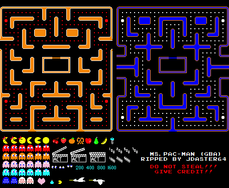
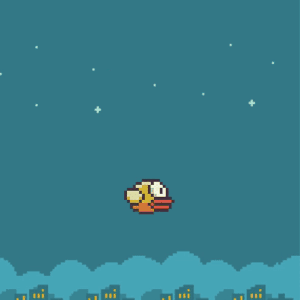
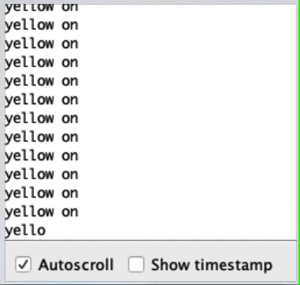
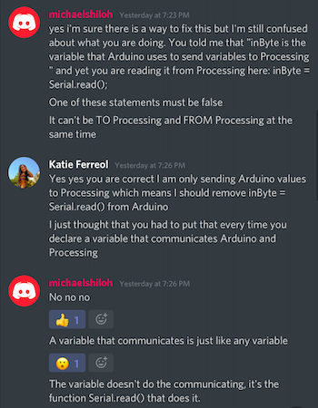
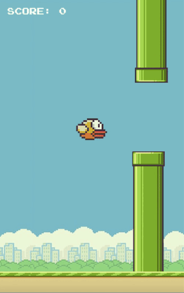

# INTERACTIVE MEDIA FINAL ASSIGNMENT: Flappy Bird Processing and Arduino

My final project will make use of a Piezo buzzer, a potentiometer, and three buttons that communicate to Processing to make a Flappy Bird game with an additional Customization Page that communicates Arduino to Processing.

## SCHEMATIC

The schematic of this idea is below, which is much simpler compared to our purely Arduino assignments. This only makes use of the potentiometer, three buttons, and a buzzer.

## INSPIRATION

My inspiration for this product was through the Piezo buzzer. I noticed that most of the songs produced on there eminated quite an 8-bit sound, so I wanted my game to embody that as well just to make it well rounded. I first wanted to do Pacman, which I started for the first few days, but it was a bit too difficult as you would need many constraints for the maze. 

Thankfully, I was able to come across an old game that I played back in 2015, Flappy Bird. Due to it being discountinued, this actually incentivized me more to bring it back to life through Processing and Arduino. I was able to find the image assets through [this Spriters Resource link.](https://www.spriters-resource.com/mobile/flappybird/sheet/59537/)

## Idea 

So, basing it primarily off the rules of this game, the instructions are simple: the player is shown a starting screen that plays alongside the Arduino-style [Pacman theme song](https://github.com/robsoncouto/arduino-songs/blob/master/pacman/pacman.ino). If the player presses the R key, they can start the game. If they press the C key, it takes them to a customization page. To fly, they just use the spacebar to avoid the pipes. Every time they successfully avoid a pipe, the [Mario 1-UP sound](https://bikeshedeffect.weebly.com/arduino-piezo-sounds.html) will play on the buzzer. If the player falls or hits a pipe, they lose.

## SETBACKS

### Collision Detection

I had quite a hard time coding the constraints of the pipes, as I realized there is no such thing as image collision detection in Processing. Therefore, my solution was to create an area using a rectangle that fit the space in between the pipes, and measure that distance as being passable. I had to do this for the pipes as well to trigger the lose function.

After I knew this was working, I removed the fill and stroke of both. Then, I used the print() function to make sure that it was doing its job, with it printing "PASS" if it passes the pipe or "FAIL" if it hits the pipe.

However, this wasn't working all the time, so I decided to invest a full day in starting from scratch and creating new constraints and making sure it is working every time the bird hits a pipe.

### Realistic Bird Movement

After this, another problem I was able to solve was getting the bird to move more like it's jumping. In the original version of Flappy Bird, whenever the bird jumps, it mimics a person jumping. However, for me, it was only floating, making it seem easier. I was finally able to look at how to mimic this by creating velocity and gravity functions to the bird.

OLD:

NEW (simple version):

### Button State-Reading

A problem I was having was making the buttons not PUSH-buttons, but STATE-buttons, meaning it would turn on when I press it once and turn off if I press it again. This was quite hard to do, as the tutorials I found made use of only one button. This meant my buttons would only change their state if the other two were off.

However, I was able to get it to work using a code that I refined to make it work for all three buttons:

    if (yellowPush % 2 == 1) {
          yellowPush = 0;
          val2 = 0;
        }
        if ((redPush % 2 == 1)) {
          redPush = 0;
          val2 = 1;
        }
        if (bluePush % 2 == 1) {
          bluePush = 0;
          val2 = 2;
        }

### Processing-Arduino Communication

Lastly, a problem I was having was regarding my Piezo buzzer: even though Processing was printing that the bird passed the pipes and the player's score would increase, it wouldn't play the 1-UP sound effect. I thought this was a problem with the buzzer itself.

However, having a talk with Professor, I realized that this was due to me serial reading an Arduino variable that _Arduino_ sends values to, even if thats not necessary because I only need to read the Processing variables.

## FINAL GAME

The final game is described accordingly:

### 1. Starting Screen

When Processing starts to run, it plays the Mario Introduction melody. Processing provides 8 seconds where the player can't choose anything to alot for the time the introduction melody is playing. In the start screen, you are given the chance to either start the game ('R' key) or to customize your gameplay ('C' key).

### 2. Customization Screen

In the customization screen, you are given the option to customize your gameplay through changing the bird's color (through the buttons) or the background (through the potentiometer). I also created visual instructions using Adobe Illustrator.

### 3. Playing Screen

When the player starts the game, they are greeted by a Get-Ready screen, showing a visual representation of how you make the bird move--by pressing the spacebar. This screen lasts about 5 seconds to give the player time to prepare.

The bird begins to move down and it is up to the player to use the spacebar to make the bird float through the pipes, playing the Mario 1-Up sound when successful and gaining a point. 

The player is able to pause and resume the game with the 'P' key. 

### 4. Game Over Screen

When the bird hits the ground or the pipes, it triggers the game over. The Game Over screen shows you your score and the medal you got: if you get 0-10 points, you get a bronze medal, if you get 10-20 points, you get a silver medal, if you get more than 20 points, you get a gold medal.

## VIDEO PLAYTHROUGH

The video of this playthrough can be seen in [this link](https://youtu.be/TgaU9xBielg).

