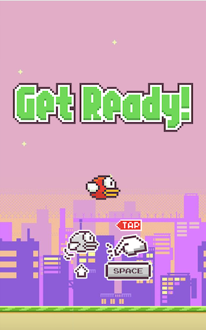

# INTERACTIVE MEDIA FINAL ASSIGNMENT: Flappy Bird Processing and Arduino

My final project will make use of a Piezo buzzer, a potentiometer, a photoresistor, and three buttons that communicate to Processing to make a Flappy Bird game. When Processing starts to run, it plays the Mario Introduction melody. In the start screen, you are given the chance to either start the game or to customize your gameplay through changing the bird's color (through the buttons) or the background (through the potentiometer). Then, when the player starts the game, the bird begins to move down and it is up to the player to use the photo resistor to make the bird float through the pipes, playing the Mario 1-Up sound when successful and gaining a point. When the bird hits the ground or the pipes, it triggers the game over. I would want to try to make it so that, when the player presses the reset button on the Arduino board, it also resets the entire game, but I'm not sure if that is possible yet.

## Schematic

The schematic of this idea is below, which is much simpler compared to our purely Arduino assignments. This only makes use of a potentiometer and a buzzer.

## Inspiration

My inspiration for this product was through the Piezo buzzer. I noticed that most of the songs produced on there eminated quite an 8-bit sound, so I wanted my game to embody that as well just to make it well rounded. I first wanted to do Pacman, which I started for the first few days, but it was a bit too difficult as you would need many constraints for the maze. 

Thankfully, I was able to come across an old game that I played back in 2015, Flappy Bird. Due to it being discountinued, this actually incentivized me more to bring it back to life. I was able to find the image assets through [this Spriters Resource link.](https://www.spriters-resource.com/mobile/flappybird/sheet/59537/)

## Idea 

So, basing it primarily off the rules of this game, the instructions are simple: the player is shown a starting screen that plays alongside the Arduino-style [Pacman theme song](https://github.com/robsoncouto/arduino-songs/blob/master/pacman/pacman.ino), to which they can use this time to change the background using the potentiometer. To start, they just press the R key and then use the J key to avoid the pipes. Every time they successfully avoid a pipe, the [Mario 1-UP sound](https://bikeshedeffect.weebly.com/arduino-piezo-sounds.html) will play on the buzzer. If the player falls or hits a pipe, they lose.

## Process and Setbacks

I had quite a hard time coding the constraints of the pipes, as I realized there is no such thing as image collision detection in Processing. Therefore, my solution was to create an area using a rectangle that fit the space in between the pipes, and measure that distance as being passable. I had to do this for the pipes as well to trigger the lose function.

After I knew this was working, I removed the fill and stroke of both. Then, I used the print() function to make sure that it was doing its job, with it printing "PASS" if it passes the pipe or "FAIL" if it hits the pipe.

After this, another problem I experienced was getting the bird to move more like it's jumping. In the original version of Flappy Bird, whenever the bird jumps, it mimics a person jumping. However, for me, it was only floating, making it seem easier. I was not able to tackle this, and I will probably work on this for my final project.

Lastly, before connecting the files between Processing and Arduino, I did not know the best way to make the user able to change the background. I then was able to get an idea of using the potentiometer and mapping it so that when it's at a specific angle, it will show a specific background.

## Final Game

The final game is described accordingly:

### 1. Starting Screen

### 2. Customization Screen

### 3. Playing Screen

### 4. Game Over Screen

