# FINAL PROJECT: Flappy Bird Remake

## DESCRIPTION

My final project will make use of a Piezo buzzer, a potentiometer, a photoresistor, and three buttons that communicate to Processing to make a Flappy Bird game. When Processing starts to run, it plays the Mario Introduction melody. In the start screen, you are given the chance to either start the game or to customize your gameplay through changing the bird's color (through the buttons) or the background (through the potentiometer). Then, when the player starts the game, the bird begins to move down and it is up to the player to use the photo resistor to make the bird float through the pipes, playing the Mario 1-Up sound when successful and gaining a point. When the bird hits the ground or the pipes, it triggers the game over. I would want to try to make it so that, when the player presses the reset button on the Arduino board, it also resets the entire game, but I'm not sure if that is possible yet.

## SHORTCUTS
[Day 1](journal.md#day-1), [Day 2](journal.md#day-2), [Day 3](journal.md#day-3), [Day 4](journal.md#day-4), [Day 5](journal.md#day-5), 

## JOURNAL ENTRIES

### DAY 1: November 21 
##### day-1

Because I thought our last assignment was the final project, I started early. I first wanted to recreate Pacman, so I was able to find the [character sprites](https://www.spriters-resource.com/game_boy_advance/namcomuseum/sheet/22732/) for the game.

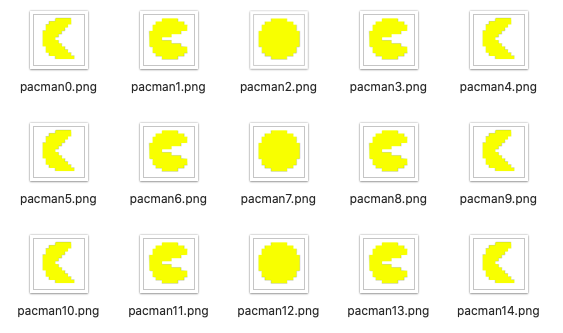

 Now having something to animate, I duplicated the 5 sprites to 15 to make the animation slower.

I also added the Pacman theme song to my Arduino, which can be seen in this [link](https://youtu.be/12gmkMfC8Mk).

**WILL I CHANGE MY PROJECT?** Because the process was relatively smooth, I do not want to change my project.

--------------------

### DAY 2: November 22
##### day-2

 I was able to make the animation move slow even without 15 sprites, so I reduced it to 5 again.
 
 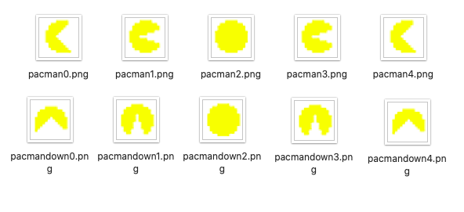
 
 After, I decided to create background of the maze, and make the pacman smaller to fit inside the maze.However, I realized that making the constraints for the maze will be too hard, and setting up random places for the ghosts to move will be too hard too.
 
 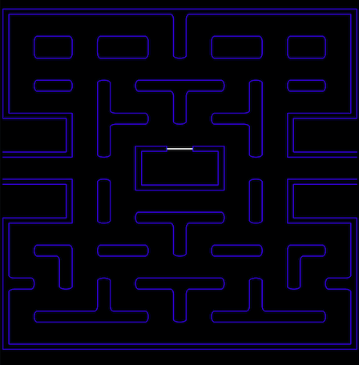
 
 Then, I tried creating the Pacman eating sound, but it was too hard because there was no correct pitch on Arduino.
 
 **WILL I CHANGE MY PROJECT?** After this, I decided to change my project to Flappy Bird.
 
 I then began to look for the character sprites for Flappy Bird, which I was able to find in [Spriter's Resource](https://www.spriters-resource.com/mobile/flappybird/sheet/59537/). After finding it, I first began to animate the background to make it look like it's constantly moving.
 
 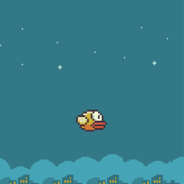
 
 --------------------
 
 ### DAY 3: November 23
 ##### day-3
 
To start, they just press the R key and then use the J key to avoid the pipes. Every time they successfully avoid a pipe, the [Mario 1-UP sound](https://bikeshedeffect.weebly.com/arduino-piezo-sounds.html) will play on the buzzer. If the player falls or hits a pipe, they lose.

I had quite a hard time coding the constraints of the pipes, as I realized there is no such thing as image collision detection in Processing. Therefore, my solution was to create an area using a rectangle that fit the space in between the pipes, and measure that distance as being passable. I had to do this for the pipes as well to trigger the lose function.

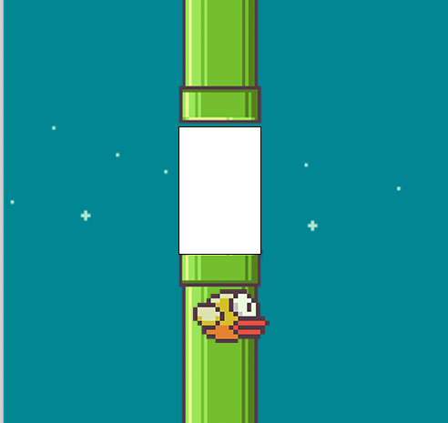

After I knew this was working, I removed the fill and stroke of both. Then, I used the print() function to make sure that it was doing its job, with it printing "PASS" if it passes the pipe or "FAIL" if it hits the pipe.

**WILL I CHANGE MY PROJECT?** Because the process was relatively smooth, I do not want to change my project.

--------------------
 
### DAY 4: November 24
##### day-4

I kept the [Pacman theme song](https://github.com/robsoncouto/arduino-songs/blob/master/pacman/pacman.ino) for the starting screen, and made it so the player can use this time to change the background using the potentiometer.

After finally realizing that our assignment was not the final project, I rushed to finish what I had so far. I added many things, such as connecting Arduino to Processing, putting the score on the top left corner, and adding the starting and game over screens. A video of my friend playing it can be found [here](https://youtu.be/x8DGZu52Qyw).

**WILL I CHANGE MY PROJECT?** Because the process was relatively smooth, I do not want to change my project.

--------------------

### DAY 5: November 25
##### day-5

I added a new customization screen, to let the player have more time and guidance to change their bird's color and the background. I created a customization screen through Photoshop, and found more sprites to appear when the player makes their choice.

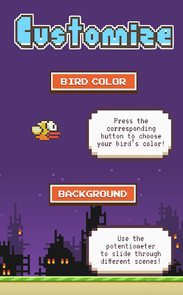
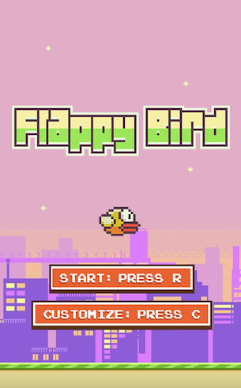

New bird color sprites:

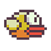
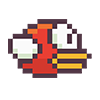
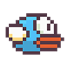

Icons to appear when the player chooses the background:

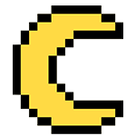

**WILL I CHANGE MY PROJECT?** Because the process was relatively smooth, I do not want to change my project.

--------------------

### DAY 6: November 27
##### day-6

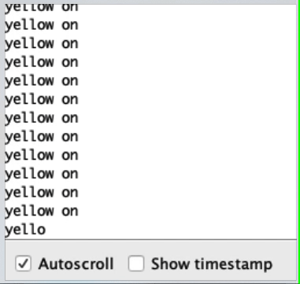
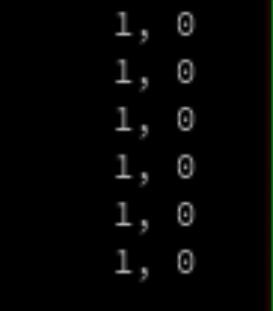

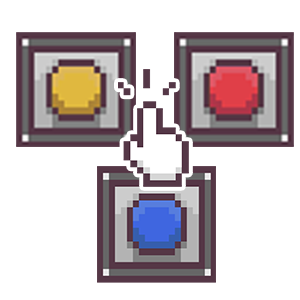

