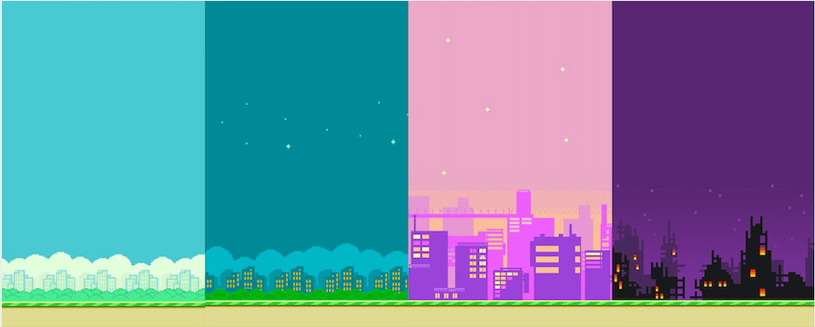
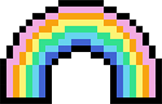

# FINAL PROJECT: Flappy Bird Remake

## DESCRIPTION

My final project will make use of a Piezo buzzer, a potentiometer, a photoresistor, and three buttons that communicate to Processing to make a Flappy Bird game. When Processing starts to run, it plays the Mario Introduction melody. In the start screen, you are given the chance to either start the game or to customize your gameplay through changing the bird's color (through the buttons) or the background (through the potentiometer). Then, when the player starts the game, the bird begins to move down and it is up to the player to use the photo resistor to make the bird float through the pipes, playing the Mario 1-Up sound when successful and gaining a point. When the bird hits the ground or the pipes, it triggers the game over. I would want to try to make it so that, when the player presses the reset button on the Arduino board, it also resets the entire game, but I'm not sure if that is possible yet.

## SHORTCUTS
[Day 1](journal.md#day-1), [Day 2](journal.md#day-2), [Day 3](journal.md#day-3), [Day 4](journal.md#day-4), [Day 5](journal.md#day-5), [Day 6](journal.md#day-6), 

## JOURNAL ENTRIES

##### day-1
### DAY 1: November 21

Because I thought our last assignment was the final project, I started early. I first wanted to recreate Pacman, so I was able to find the [character sprites](https://www.spriters-resource.com/game_boy_advance/namcomuseum/sheet/22732/) for the game.

 Now having something to animate, I duplicated the 5 sprites to 15 to make the animation slower.

I also added the Pacman theme song to my Arduino, which can be seen in this [link](https://youtu.be/12gmkMfC8Mk).

**WILL I CHANGE MY PROJECT?** Because the process was relatively smooth, I do not want to change my project.

--------------------

##### day-2
### DAY 2: November 22

 I was able to make the animation move slow even without 15 sprites, so I reduced it to 5 again.
 
 
 
 After, I decided to create background of the maze, and make the pacman smaller to fit inside the maze.However, I realized that making the constraints for the maze will be too hard, and setting up random places for the ghosts to move will be too hard too.
 
 
 
 Then, I tried creating the Pacman eating sound, but it was too hard because there was no correct pitch on Arduino.
 
 **WILL I CHANGE MY PROJECT?** After this, I decided to change my project to Flappy Bird.
 
 I then began to look for the character sprites for Flappy Bird, which I was able to find in [Spriter's Resource](https://www.spriters-resource.com/mobile/flappybird/sheet/59537/). After finding it, I first began to animate the background to make it look like it's constantly moving.
 
 
 
 --------------------
 
 ##### day-3
 ### DAY 3: November 23
 
To start, they just press the R key and then use the J key to avoid the pipes. Every time they successfully avoid a pipe, the [Mario 1-UP sound](https://bikeshedeffect.weebly.com/arduino-piezo-sounds.html) will play on the buzzer. If the player falls or hits a pipe, they lose.

I had quite a hard time coding the constraints of the pipes, as I realized there is no such thing as image collision detection in Processing. Therefore, my solution was to create an area using a rectangle that fit the space in between the pipes, and measure that distance as being passable. I had to do this for the pipes as well to trigger the lose function.

After I knew this was working, I removed the fill and stroke of both. Then, I used the print() function to make sure that it was doing its job, with it printing "PASS" if it passes the pipe or "FAIL" if it hits the pipe.

**WILL I CHANGE MY PROJECT?** Because the process was relatively smooth, I do not want to change my project.

--------------------

##### day-4
### DAY 4: November 24

I kept the [Pacman theme song](https://github.com/robsoncouto/arduino-songs/blob/master/pacman/pacman.ino) for the starting screen, and made it so the player can use this time to change the background using the potentiometer.

After finally realizing that our assignment was not the final project, I rushed to finish what I had so far. I added many things, such as connecting Arduino to Processing, putting the score on the top left corner, and adding the starting and game over screens. A video of my friend playing it can be found [here](https://youtu.be/x8DGZu52Qyw).

**WILL I CHANGE MY PROJECT?** Because the process was relatively smooth, I do not want to change my project.

--------------------

##### day-5
### DAY 5: November 25

I added a new customization screen, to let the player have more time and guidance to change their bird's color and the background. I created a customization screen through Photoshop, and found more sprites to appear when the player makes their choice.

New bird color sprites:

Icons to appear when the player chooses the background:

**WILL I CHANGE MY PROJECT?** Because the process was relatively smooth, I do not want to change my project.

--------------------

##### day-6
### DAY 6: November 27

I decided to work on Arduino today. I wanted the pushbuttons to act as states, which meant I wanted them to stay on when pressed. Using help from [this video](https://www.youtube.com/watch?v=uCBuilKKxuk&ab_channel=learnelectronics), I was able to get them all working. However, this proved to be quite hard to do for three buttons, as the order made it so that you cannot turn another button on unless the top one is off.

However, after experimenting with the code, I was able to get it to work. Then, all I had to do was transfer my code to my other Arduino file and communicate with Processing. However, since I was only working with one signal so far using the potentiometer, adding a second signal would disrupt the flow of the serial read and make the background glitchy. 

After reading about sending multiple signals from Arduino to Processing through [this link](https://www.dummies.com/computers/arduino/how-to-send-multiple-signals-from-the-arduino-to-processing/), I was able to get the code running smoothly by creating an array of the signals and putting them into one string. The clean serial read is below:

Then, since I had all the necessary components, I began to play around with the customization screen. Deciding there were too many words and players who don't know Arduino components may be confused with "potentiometer", I decided to create more visual instructions. I created an 8-bit potentiometer and buttons through Adobe Illustrator.

Adding them to the customization screen, it now looks like this:

One problem I have to solve is getting the communication from Processing to Arduino to work again, as I noticed with adding the new code is that my game no longer plays the 1-UP sound when adding a point.

**WILL I CHANGE MY PROJECT?** Because the process was relatively smooth, I do not want to change my project.

--------------------

##### day-7
### DAY 7: November 29

Today, I spent the ENTIRE day fixing my pipes and their constraints. For my last assignment, I was bothered that sometimes, when the bird would hit the pipe, it wouldn't recognize it as being a game over. I decided to completely delete my whole code and start fresh. This proved to be a challenge. In a new, simple Processing file, I first started off making a bird with smooth jumping action, unlike the one I had before that was just floating.

Then came the difficult part. Instead of using two separate rectangles that would reload after it left a screen, I decided to use an array. Using tutorials with [programming arrays and class objects](https://www.youtube.com/watch?v=QUFkRIh706k&ab_channel=JohnMcCaffrey) and also [arrays with flexible size](https://www.youtube.com/watch?v=Hf-AHwRaodA&ab_channel=TheCodingTrain), I was able to make an array pipes that would load a new one every time the framecount would equal zero.

After making sure it all ran smoothly on the simple file, I transferred it all to my main Processing file and tweaked it. I also added a new Game Over screen. The final product turned out like this:

However, after trying to create a restart function for my game, I realized how difficult this will be, as I would have to delete my use of a noLoop(); which stops the entire screen from moving like the game were still on. I may need to remove this aspect from the game.

I was also quite confused as to why, even though the score was increasing, the 1-UP sound was not playing for some pipes. This may be due to my Piezo buzzer being broken, but I am not entirely sure.

Since I will be implementing the bird's moves to be determined by the photoresistor, I made an 8-bit version of that as well.

**WILL I CHANGE MY PROJECT?** Because the process was relatively smooth, I do not want to change my project.

--------------------
