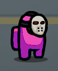

# Production Midterm: 'Among Us' Processing Game

## DESCRIPTION
For this midterm project, I decided to create a game inspired by the popular group game at the moment, [Among Us](http://www.innersloth.com/gameAmongUs.php). This has become my favorite game over these past few months for the cute characters. My game entails having to run up to spawning targets and killing them before the timer runs out. Since I put a run down of every day in my journal, I will give a brief summary on this README file.

## INSTRUCTIONS
When you load the file, you are met with the startingrting screen. I used an array of circles that move from left to right to give the appearance of stars. You are given the choice to either start the game, or be given a list of instructions first.

When the game starts, you are the orange, "spooki" player with the pumpkin hat. Your job is to kill as many of the targets--those with the pink, scary mask--in 30 seconds.

You use the arrow keys to move closer to the target, after you are close enough, there is a kill button on the lower right corner that allows you to kill the target. When you press this, the program sees if you are close enough to the target. If you are, it will play a killing sequence and respawn the target in a new area of the map.

After the 30 seconds, you are met with a screen that shows you time is up and your score. If you want to play again, simply press P, and it will reset the timer and your score. Putting everything together, I finally finished the game today. The full run through, including replaying the game, is below (I made the gif in 2X speed since it's a long game and could not fit in a gif in normal speed):

