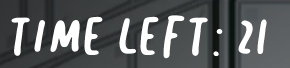

# Production Midterm: 'Among Us' Processing Game

## DESCRIPTION
For this midterm project, I decided to create a game inspired by the popular group game at the moment, [Among Us](http://www.innersloth.com/gameAmongUs.php). This has become my favorite game over these past few months for the cute characters. My game entails having to run up to spawning targets and killing them before the timer runs out.

## JOURNAL ENTRIES

### DAY 1: October 9
I was super interested in it after watching Professor give us a tutorial in class. After looking at the website we were given in class for character sprites, I found a character sprite of the default player. I'm not sure how to change the colors of the character through Processing, so I might have to use Photoshop instead.

After tinkering around with a code and searching tutorials on YouTube, I was able to get it to work properly. It now walks whenever the player presses the arrow keys. What I don't know how to do is to make the character turn when it moves left, right now it looks like it's moonwalking.

**WILL I CHANGE MY PROJECT?** I will not change my project since everything is going smoothly.

--------------------

### DAY 2: October 14
After finishing my October 13 assignment, I wanted to go back and work on this again, so I decided to add the killing animation early. It was a bit hard adding two character sprites, but I was able to do it. Just using a simple mousePressed function on any part of the screen, I tested the killing animation and got it to work properly on one target before multiplying them to respawn.

**WILL I CHANGE MY PROJECT?** I will not change my project since everything is going smoothly.

--------------------

### DAY 3: October 16
I added a kill button, and made it so that the player clicks the button and not anywhere on the screen to kill the target. I also set restrictions so that the player has to be close to the target to kill it. I was able to make the target respawn, however I have some problems with letting the dying animation play all the way before respawning the character. I was also able to make the character look to the left when walking left using the transform function.

I was also able to add the background of the game by editing a photo of the actual game so there's no boxes around. 

I also added a timer for the game to stop after 30 seconds, and a score function to count how many times the player kills their target.

**WILL I CHANGE MY PROJECT?** I made great progress on this project today, and I have not made a big decision to change my project since everything is going smoothly.

--------------------

### DAY 4: October 23
I began to add the starting page, which I had edited using Photoshop. Using restrictions for the mousePressed() function, I made it so that it looked like when the player pressed the "button" or a specific part of the screen, it will show the instructions or start the game. I used a rect() function for the instructions.

I also wanted the starting page to fade out slowly with the entrance music, which proved to be more difficult than I expected since the timer wouldn't start at 30, but at 26. After some time, I was able to make it work. I created a specific void for the fade out to put in the draw() function, since the function will only play once if it's in the mousePressed() function. This code is below:

    void down() {
      if (startopacity < 255) {
        startopacity = startopacity - 10;
      }
    }

I had also tried to solve my problem of the target disappearing before the full death animation played, but I could not find out how to do it. I decided to save it for the next day.

**WILL I CHANGE MY PROJECT?** I will not change my project since everything is going smoothly.

--------------------

### DAY 5: October 24
I was finally able to properly code the target so it plays the killing animation fully before respawning in a different location. This marked the end of my full coding process, leading me to have only the proper coloring of the characters left to do. What I had to do was restart the image array of the target to 0 once it reaches 14. This corrected code is below:

    void spawnNew() {
      if (die == 0) {
        full3 = 0;
        full4 = 255;
        if (fall >= 14) {
          randomx = int(random(300, 600));
          randomy = int(random(300, 600));
          fall = 0;
        }
      }
    }

I was also able to make the game restart after the timer finishes. After finalizing all my coding, I used Photoshop to recolor the character sprites according to their role in the game. Since I could not solve my problem of changing the sprites' color in Processing itself, I decided to manually change each sprite's color--orange for the player, pink for the target.

Seeing that I wanted to make the player and the target distinct using more than just their colors, I used the extra hats given by the provider of the character sprite to give them a pumpkin hat and a massacre mask for a Halloween theme.

Putting everything together, I finally finished the game. The full run through, including replaying the game, is below (I made the gif in 2X speed since it's a long game and could not fit in a gif in normal speed):

--------------------

### DAY 6: October 27

After looking at my project one last time, I realized that I did not add many in-code shapes, only using a rectangle for the instruction screen. Deciding to add more shapes using Processing, I decided to make a moving star class using ellipses to add an animated feeling to the starting screen.

