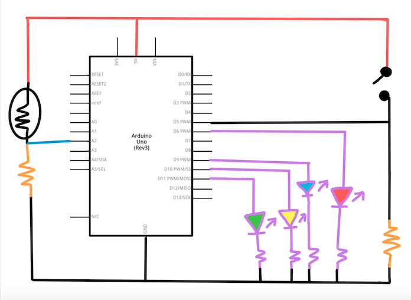

# Arduino Assignment 1: Analog VS. Digital
This week's assignment involved using Arduino to determine the difference between digital and analog reading and writing. For analog, there is a potentiometer on the left that makes turns on a specific LED depending on the value you turn it to, and for digital, there is a button that, when pressed, will turn all the lights off except for the one chosen by the potentiometer. It can turn into a fun game to play with friends to guess which light will be one after pressing the button.

[The link to the full video is here!](https://vimeo.com/477128172)

## Schematic
The build of the final schematic is below, which I made through a combination of drawing and Photoshop. This build involves connecting all button and LED wires from the digital pins to one side of the breadboard. This then connects all of the wires to one main GND wire, which is what powers it all up.

## First Build and Setbacks
At first, I wanted to make use of the photo resistor, which was the first analog sensor that we learned how to use in class. It was going fairly well, with the code working the way I had hoped. I was actually stuck because my LED's were less bright than usual, but I figured out after a while that I was using the wrong resistor! _It's crazy to think how such a small mistake can make a big difference._

In the gif above, the program shows a red LED if it's not covered by my finger, as the photoresistor is reading higher levels of light. Then, when I cover it with my finger, the levels drastically go down, triggering the code to light up the blue LED and turn off the red LED.

    int sensorValue = analogRead (A2);
      Serial.println(sensorValue);

      if (sensorValue > 600) {
     analogWrite (redLEDPin, 100);
     analogWrite (blueLEDPin, 0);
     } else {
     analogWrite (redLEDPin, 0);
     analogWrite (blueLEDPin, 100);
     }

However, though this was going well, I wanted a more fixed value with my serial readings, and I didn't think a photo resistor could provide me with that. Because it reads light, my code might work and not work depending on the environment I'm in. With this being said, I chose to switch to the potentiometer, which gives clearer, fixed values.

 

## Second Build and Setbacks
My second build, visually, looked very similar to my first project, as I decided to make use of four LED's instead of just two to prove the potentiometer's purpose more. My new build, as it has more fixed values, programs my Arduino so that, when the value is between 200 to 400, it turns on the red LED, if it's between 400 to 600, it turns on the blue LED, if it's between 600 to 800, it turns on the yellow LED, and if it's greater than 800, it turns on the green LED.

My problem with this build was actually a bug with Arduino: I wanted to use multiple if statements for one function using "&&", however it wasn't allowing me to upload the program. Confused, I tried googling what was wrong and I was doing everything right. However, after researching the error, I realized I just had to connect and disconnect my Arduino board and it worked again. _Very strange._

## Final Game
The final runthrough of the game (in 2x speed since gif's can only be no more than 30 seconds) is below. As shown in this playthrough, all LED's start off on, then when you press the button, it digitally writes for all of them to turn off. However, since it's below my analog reads, it leaves the one the potentiometer turns on lit up. To change which LED is lit up, twist around the potentiometer to your preferred LED. This can turn into a fun game to play with friends to guess which light will be one after pressing the button.

