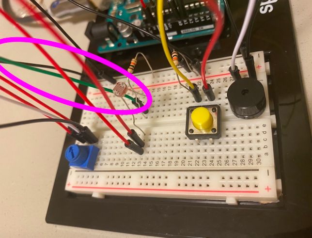

# Arduino Assignment 3: Piezo Buzzer & Servo Motor
This week's assignment makes use of a buzzer, servo motor, button, photoresistor, and potentiometer to create a "Christmas Radio" to commemorate the holiday season.

Mapping the potentiometer from 0 to 4, each number represents a new song, which will play if you hold down the button (1 for We Wish You A Merry Christmas,
2 for Santa Claus is Coming to Town, 3 for Jingle Bells). As the song plays, the servo motor--to which I added a clay Christmas tree on top--will spin accordingly.

To make use of the photoresistor as well, I made an easter egg so that, if all the numbers in the read.serial function is equal to zero
(so if the potentiometer is turned all the way down and if the photo resistor is covered), it will play the Philippine National Anthem if you press down on the button.

[The link to the full video is here!](https://vimeo.com/479846751)

## Schematic
The build of the final schematic is below, which I made through a combination of drawing and Photoshop. I had a much easier time making this schematic after following Profesor Shiloh's example in class. I'm curious though because he mentions that input and output should be in different sides of the Arduino board, however, from all the schematics I've seen, the button (which I assume is an input) is on the right with the LED's (output). Why is that?

## First Build and Setbacks
At first, I wanted to make use of the photo resistor, which was the first analog sensor that we learned how to use in class. It was going fairly well, with the code working the way I had hoped. I was actually stuck because my LED's were less bright than usual, but I figured out after a while that I was using the wrong resistor! _It's crazy to think how such a small mistake can make a big difference._

 
 
 

