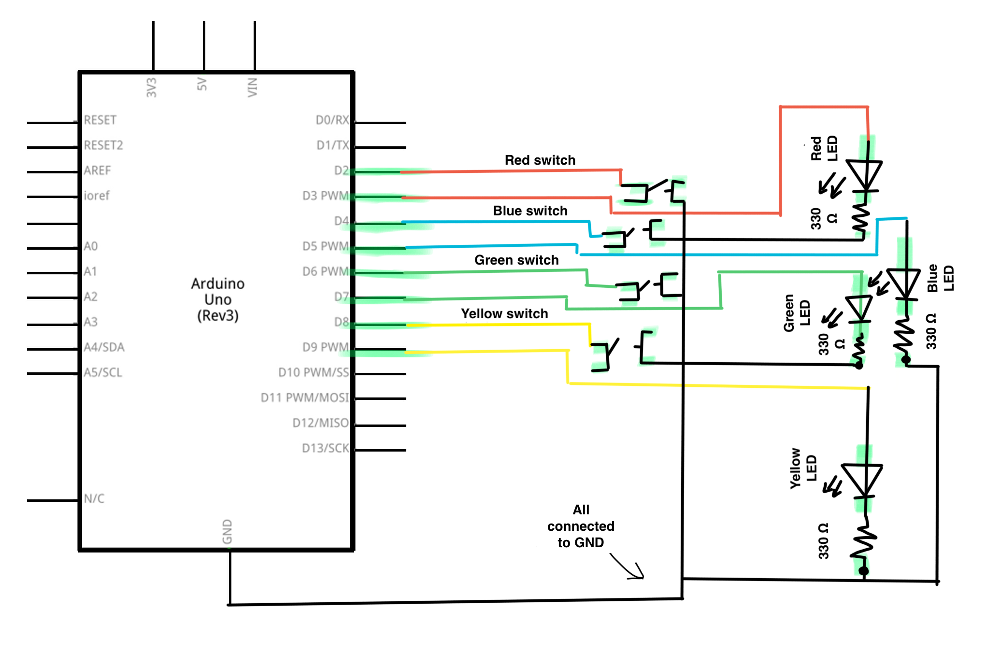
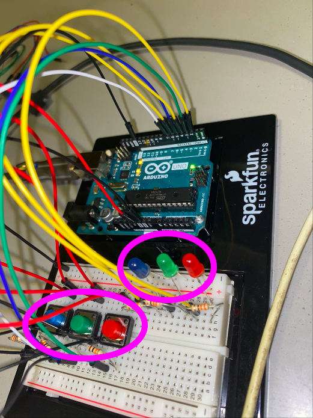
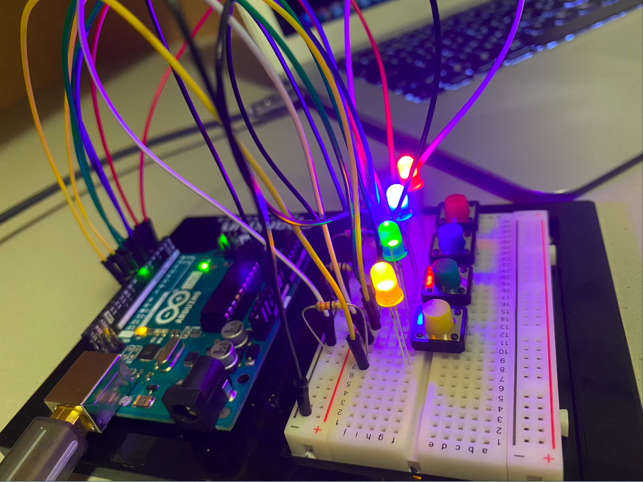
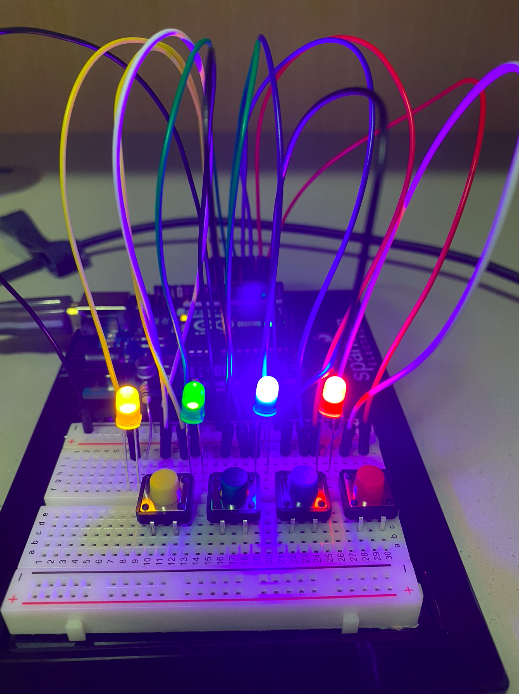

# Arduino Assignment 1: LED Game
This week's assignment involved using Arduino switches/buttons and LED lights to create a puzzle game. Through looking at tutorials and using what we learned in class, I decided to make a game that involved memorizing a pattern given by the Arduino program.

## Schematic
The build of the final schematic is below. This build involves connecting all button and LED wires from the digital pins to one side of the breadboard. This then connects all of the wires to one main GND wire, which is what powers it all up.

## First Build and Setbacks
At first, I believed that I would be able to build this program using only the knowledge we learned in class. However, this proved to be quite challenging, as we were taught to only put the LED's in a specific way on the breadboard, not making it visible to the future player.

In addition, because I did not know that you could connect wires on the breadboard itself instead of constantly connecting it to different GND pins, I made use of more wires than needed, making it look messier than expected. You can see from the gif below that I was struggling getting my finger inside the tight space of where the buttons were to activate the LED.

With this being said, I decided to look at various tutorials and walkthroughs of how to properly position these parts of the build.

## Second Build and Setbacks
This trial was definitely more organized and I knew more of what was going on rather than blindly follow and hope that it would work. My build now had the colored LED's and its corresponding color button next to each other, with the wires behind instead of around them. This makes it easier for the player to access. I wanted to add a buzzer, however, I decided to withdraw it as I could not get it to work. 

However, the next setback I experienced was the programming aspect of the game. Because I have never learned C or C++ before, some of the parts of coding were quite difficult to follow on just self-teaching, especially since most of the tutorials I found were very heavy on using C/C++, such as using #define and other parts.

However, I was able to realize that you did not technically need C/C++, as the game can run on majority Processing language alone. Even through this, I was able to recognize new parts of Processing that I did not know before, such as the "break" command, the "long" variable, and also the "do, while" function.

## Final Game
The final runthrough of the game (disregard the buzzer) is below:

