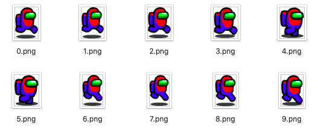
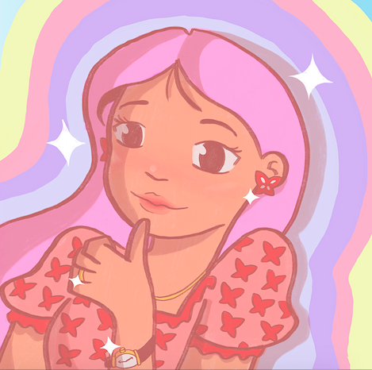
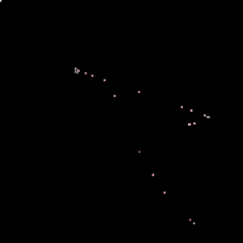
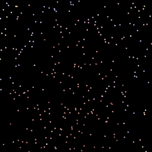
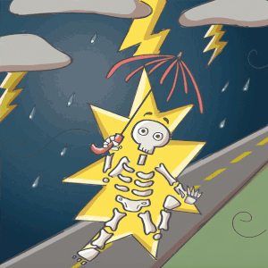

# Production Assignment 5: Processing Image Manipulation

For this week, I wanted to do an "image comparison slider" that showed a girl walking in the rain peacefully turning into a dark day after being struck with lightning and showing her entire skeleton. The final result (without sound) is below:

## Inspiration (IDEA 1)
At first, I actually wanted to create an animated avatar walking with sounds. I was super interested in it after watching Professor give us a tutorial in class. After looking at the website we were given in class for character sprites, I found a character sprite of my favorite game recently, [Among Us](http://www.innersloth.com/gameAmongUs.php). 

However, though I was able to get it to work fairly well, I decided to save it for our Midterm project game, as having a character there would be more suited. So, because of this, I decided to get a new idea.

## Inspiration (IDEA 2)
After watching more of the Coding Train's image manipulations, I decided to take one of my digital drawings and make it look either like a moving mosaic, OR as if the user was drawing the artwork himself/herself. A picture of my chosen artwork is below:

## Idea 2 Coding Process and Setbacks
First coding the scenario where the user "draws" the artwork himself or herself, I started of with multiple small squares that would show up according to the user's X and Y position. However, after trying it, I noticed early on that it takes a *very, very, VERY* long time to fill the whole canvas. My attempt is shown below:

I then proceeded to try my second idea, which was a moving mosaic. Using a tutorial from Coding Train, I coded it so that the multiple tiny squares would appear at different times in different areas of the canvas until it creates a coherent image. After that, it will continue to produce squares until it looks like a moving mosaic. The runthrough of the portrait is below:

However, I ultimately did not want to go through with this idea because I had no contribution to the code and was only following the Coding Train. Since I am in this class to learn, I wanted to write code that I know would work and that I know what was happening. I decided to scratch this idea and move to my third idea.

## Inspiration (IDEA 3)
I suddenly remembered a fun way to show different images that are starkly similar, which was through an image comparison slider. I've seen various versions of this, from showing before and after photos to just showing photos with different filters. Seeing as I only knew how to code this in HTML, I figured it would be really fun to try it out on Processing this time. An example of what I was trying to achieve is below:

## Idea 3 Coding Process and Setbacks

After drawing the two images needed for this slider and sending it over to Processing, coding this simple program actually turned out to be quite difficult, as this was making use of a new function we learned in class called get(). Because I did not know that I was supposed to use this function yet, I thought it would be enough to load the image and make it move whenever mouseX moves. However, this proved to be unsuccessful, as it stretched the image instead of cropping it.

After getting help from Professor on the Discord, I was finally able to get it to work. After adding a line to make the slider more visible, it finally worked the way I aspired it to be.

## Final Details and Clever Aspects
Some clever aspects that I wanted to add to my program was interactivity as the program loads, in addition to if the user moves the mouseX to a certain point. I decided to add raindrops through lines and arrays to make the rain look more real. I also added a mouseOver function that would see that, if mouseX reaches the halfway point of the canvas, it would play a thunder sound to make it look like the thunder is just hitting the girl.

