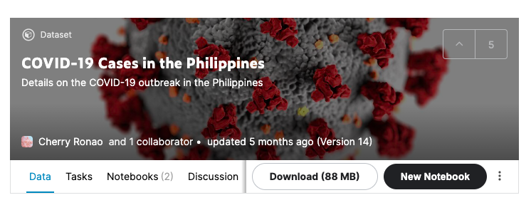
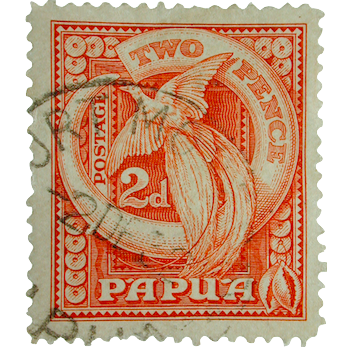

# Production Assignment 4: Processing Generative Text

For this week, we were asked to make either a data visualization or a generative text using Processing. The concept of my assignment is a "Make Your Own Love Letter", Madlibs-style text generator that would allow users to choose the best randomly generated Madlib love letter and "send it out" after multiple attempts. The final runthrough of the program is below:

## Inspiration
Having only learned about data visualization in class, I decided that that might be the safest option. Going onto Kaggle, I tried looking for a dataset to visualize, ultimately deciding on [COVID](https://www.kaggle.com/cvronao/covid19-philippine-dataset) cases in the Philippines from January to present. 

However, I found this a bit too general and overdone, especially with global COVID cases and circle sizes on each country pertaining to how many total cases there are. I wanted to do something more unique that went beyond turning data into graphs. As a result, I decided to make generative text and create a short story or poem with it.

I was inspired by the game of Madlibs, a game that I played with my family when I was younger. I also remembered before that one of the Youtubers I watch, Cody Ko, did a [video](https://www.youtube.com/watch?v=pr3OiTIkCFk&ab_channel=Cody%26Ko) with an online version of Madlibs, Madtakes.com.

With this being said, I took formatted texts from Mad Takes and edited them accordingly to my code.

## Coding Process and Setbacks
I first started off with a local string inside my Processing file, just to test how it would look like. After, I set a mousePressed() function to make my chosen words such as verbs, adjectives, celebrities, etc. change whenever the user would click. The rough version is below.

However, once I input the .csv file did I start to encounter some problems. Because this was my first time working with external files outside of Processing, I wasn't sure if I was supposed to input the values per row (like how we did in class) or per column. In addition, I didn't know how to extract the strings and turn them into arrays so I could properly randomize them in the generator. I felt like it wasn't possible, since the only way I could turn the strings into arrays was in the setup() function.

After getting feedback from Professor Shiloh in the Discord chat, I finally realized my mistake--I was *creating* and *initializing* the variables inside the setup() function, when what I should have been doing was *creating* them in the whole file (above setup) and *initialize* them in the setup() function. This solved my problem entirely, and I was able to randomize my words accordingly. 

However, I came into another problem--when I used the variable more than once, it wouldn't call the random function again and made it the same word. An example is shown below:

I thought that there would be a function that would allow me to reload the random() function when one was used. However, after talking with a few CS majors, I found out that the only way to do this (apparently) was through declaring a number of variables pertaining to how many are used in the text (e.g. 7 verb variables for 7 verbs in the text). After this, it finally worked the way I wanted it to work.

The last problem I had was when the file first loads, it always shows the values in the row/column 0, then would randomize after being clicked the first time. This is shown below:

However, I was able to fix this by providing the user with a cover screen so it didn't show the text. Then, after clicking, does it show the first fully randomized text. The picture of the cover is shown below:

## Final Details and Clever Aspects
After finalizing my code, I wanted to add more aesthetic aspects rather than just let it be a plain screen with random words. I used a background of a crumpled paper to give it the effect of a real handwritten letter, and I added stamp and pen .png files to make it look more realistic. In addition, I also put heart and trashcan sketches on the corners in the same color as the text to make it look hand-drawn.

I first wanted to make the trash doodle a gif, however it would play too fast, and I figured it might be too distracting, so I just changed it to a picture.

