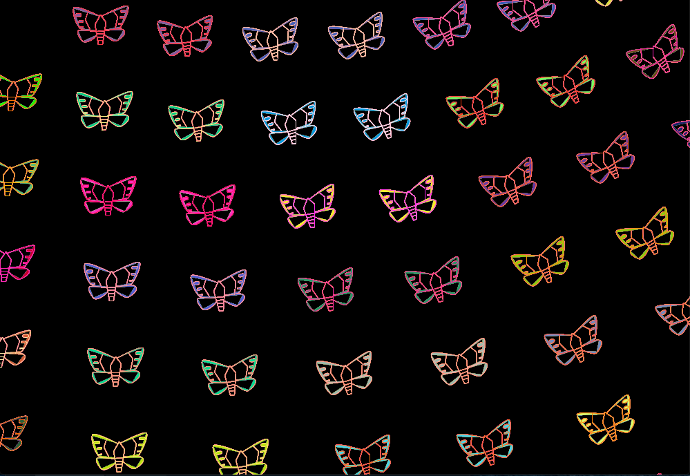
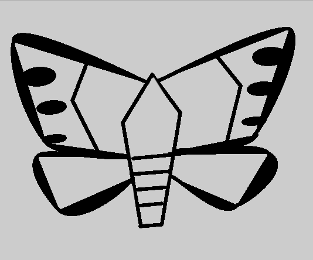
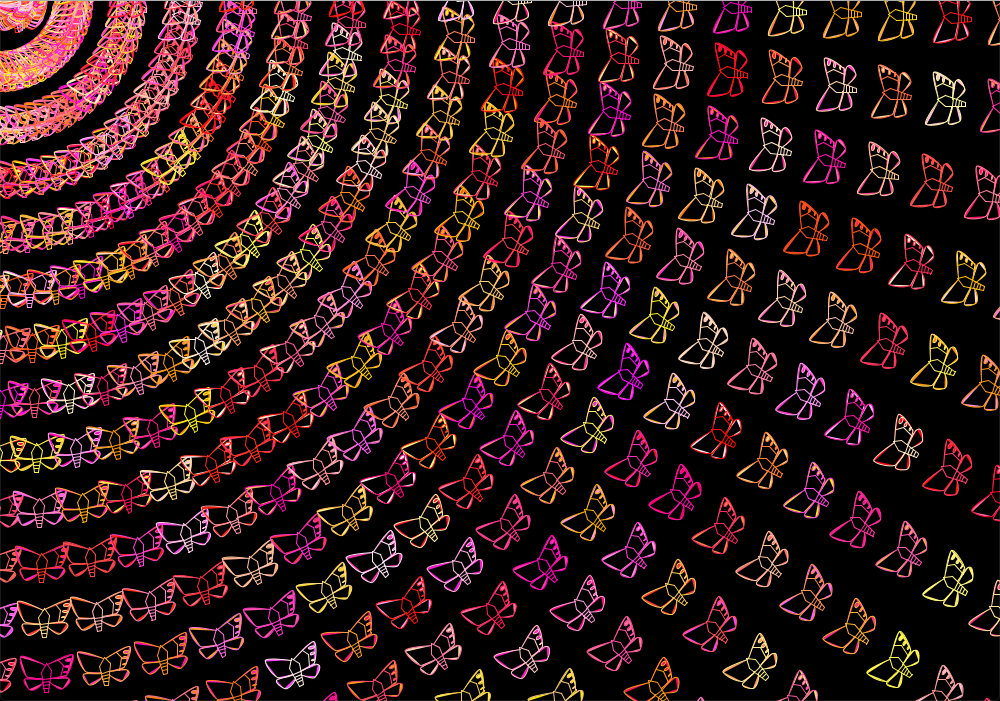

# Production Assignment 2: Processing Work of Art

Having experience with Processing from the previous assignment, I was able to finish this assignment at a quicker time, even if it involved new commands. My final work of art is shown below:

and the animated version of my file is below:

Some difficulties I encountered during the creation of my work of art is as follows:

## 1. Attention to detail
Because I wanted this work to be a step up from what I coded for my first assignment, I wanted it to resemble a butterfly. As a result, I used the curve() function for the first time for the wings, and lines and ellipses for the detail. This, I could say, was the longest part in my coding process. A picture of my rough sketch is shown below:

## 2. Animating different colors inside the while() function
For my work of art, I wanted different butterflies to show different colors every second, to give an illuminated light effect like those you see on Christmas. However, when putting the random color generating code *outside* the while() function, it would only generate random colors and leave it at that specific color for the whole run, not changing color like I wanted to.

        void wings(int xstartingpoint, int ystartingpoint) {
            translate(xstartingpoint, ystartingpoint);
            stroke(255, random(255), random(255));
              fill (random(255), random(255), random(255));
              strokeWeight (3);
              }

However, after watching The Coding Train on Youtube and how to create animations while still using the while() function, I realized that you have to add the random color generating code *inside* the while function.

         void pattern() {
            xstartingpoint = 400;
            ystartingpoint = 100;
            while (xstartingpoint < width) {
              butterfly.wings(xstartingpoint, ystartingpoint);
              butterfly.wings(xstartingpoint, ystartingpoint);
              xstartingpoint = xstartingpoint + 1;
              stroke(255, random(255), random(255));
              fill (random(255), random(255), random(255));
              strokeWeight (3);
            }
          }

## 3. Positioning of butterflies
Early on in my coding process, I found that putting my code inside the while() loop were causing my butterflies to be laid out in a mandala pattern, and I didn't know why. This may have been caused by my constant rotation of the shapes when I was initially sketching the butterfly, which was then carried out when I was moving butterflies to the right. Thankfully, after setting restrictions of the x and y starting point, I was able to get them in a straighter, cleaner pattern.

