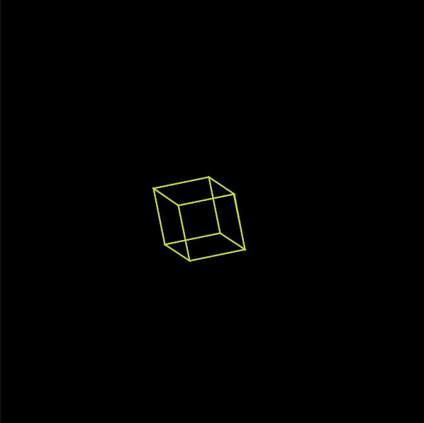

# Production Assignment 2: Processing Object-Oriented Programming

For this week, I wanted my artwork's concept to portray a sort of "galaxy" mixed with "futuristic" style, while also combining geometric shapes. My final animated artwork for this week is below:

## Inspiration
I at first, was inspired by the Coding Train's [ending screen](https://www.youtube.com/watch?v=o9sgjuh-CBM) shown at of their tutorial videos (minute 22:40). Because of this, I wanted to create a beach/sunset style artwork that would transition from day to night.

However, when searching for ways on how to add glow to the sun, I came across this [Reddit post](https://www.reddit.com/r/processing/comments/d6kz2f/glow/) that showed various 3-dimensional cubes moving in different directions:

With this being said, I wanted to creat various 3D cubes moving closer to the screen in different directions, then disappearing off to the side.

## Coding Process and Setbacks
I first started off creating the cube using different lines. However, after remembering that I might want to fill in the shapes, I realized that I should use quadrilaterals instead (it would also make things easier). The rough sketch of the cube is shown below:

With that, I was ready to create my artwork. It first started off very smoothly, testing the animation with one cube to ensure that it was working fully. I had to scale down and translate the cube so it would start in the middle of the canvas and grow bigger with time. However, when it came to creating an array so the cubes could move in different directions and timings, the scaling and translation would reload itself every time there was a new cube, making the animations faster and the cubes smaller. Because the cubes went past the screen so quickly, I could not tell what the problem was. I even experienced glitches with the cubes, which is shown below:

With this being said, I decided to change my artwork.

## Idea #2 and Setbacks
At first, I did not know what else I could do with the cube, which led to me playing around with the code for a set of days. My first proposal--getting a column of cubes to popup one after the other with a y++ function--did not work and it just continued going down below the canvas height, even with a restriction. Finally, after testing various animations, I found one that was particularly interesting--rotating each cube 20 degrees, creating a circle. I also made each cube different color. The first sketch is shown below:

However, I did not just want it to be a simple circle design. Since I wanted this to be a slight step higher from my last assignment, I wanted it to have a bit of interactivity for the user. I decided that, whenever the user moves his/her mouse, the cubes will move farther apart. In addition, I made two circles and set them apart from each other to give it a more dynamic nature.

## Final Details and Clever Aspects
After creating this code, I felt like this was a bit too simple and too similar to my second assignment. I looked for various ways to make the artwork more unique. Lastly, as for clever aspects, I decided to add small circles that would surround the cube, making it look like "stars" and add more detail rather than just the cubes. I also tried finding code that would help me create a gradient bacgkround from dark purple to black. The final artwork is shown below:

